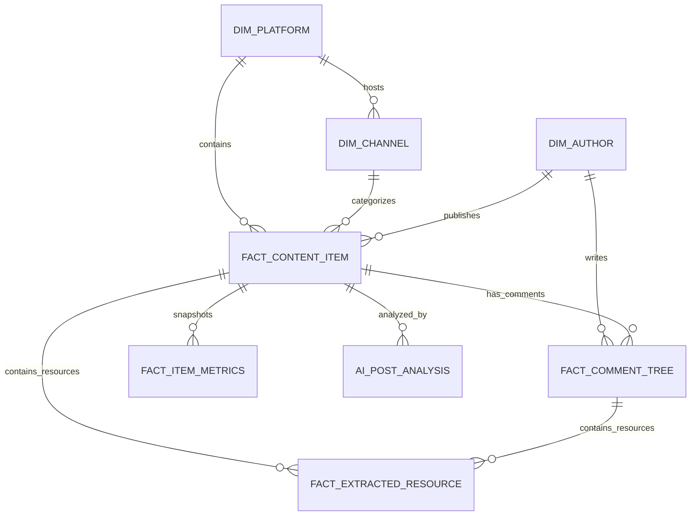
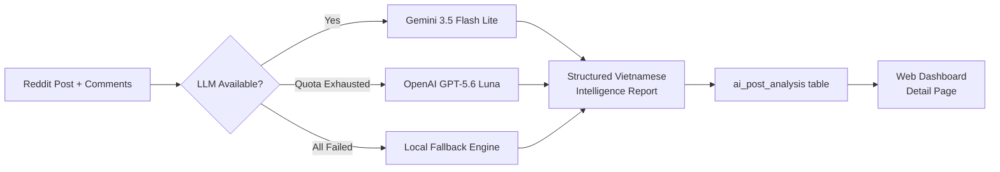

# Spec: Multi-Source Technology & Information Intelligence Radar

- Date: 2026-07-23 (Updated: 2026-07-24)
- Status: blocked
- Author: Antigravity AI & System Architect

> 2026-07-28: Tạm dừng vì roadmap đa nguồn vượt phạm vi internal-production
> Reddit-first và status cũ không hợp lệ với factory. Safe article/report ingestion
> đã được tách sang `2026-07-28-safe-source-content-ingestion.md`; X/ArXiv/RSS
> crawler độc lập chưa thuộc release này. WP0 của program spec sẽ audit và đóng.

---

## 1. Context & Philosophy

### 1.1 Problem Statement
Nguồn tin tức công nghệ và tri thức giá trị cao hiện bị phân tán trên nhiều nền tảng (Reddit, X/Twitter, ArXiv, Substack, GitHub). 
Giá trị thực sự của một bài viết/tin tức **không chỉ nằm ở tiêu đề hay nội dung của tác giả gốc (OP)**, mà nằm ở:
1. **Sự tương tác & phản hồi từ cộng đồng** (upvotes, velocity, retweets, bookmarks, comment depth).
2. **Trí tuệ tích tụ trong các bình luận (Comment Intelligence)**: Nơi các chuyên gia đóng góp góc nhìn thực chiến, cảnh báo rủi ro, phát hiện ý kiến trái chiều.
3. **Các tài nguyên phái sinh được chia sẻ**: Các Repository GitHub, Bài báo khoa học (ArXiv), Tài liệu kỹ thuật, Benchmark mà cộng đồng đính kèm trong thảo luận.

### 1.2 Core Goal
Xây dựng **Nền tảng Tình báo Thông tin Đa nguồn (Multi-Source Information Intelligence Platform)** có khả năng:
* Thu thập & chuẩn hóa dữ liệu từ **Reddit, X (Twitter), Web RSS & ArXiv Papers**.
* Đánh giá giá trị tín hiệu dựa trên **Mô hình Điểm đa chiều (Composite Value Scoring)**.
* Trích xuất sâu tri thức từ bình luận & tài nguyên đi kèm (GitHub Repos, Papers, Tools).
* **Đúc kết tri thức bằng LLM** thành báo cáo phân tích 100% tiếng Việt có giá trị thực.
* Cung cấp **Web Dashboard hiện đại** đáp ứng nhu cầu theo dõi và tình báo thông tin.

---

## 2. Multi-Source Schema Architecture (Platform-Agnostic Model)

### 2.1 Core Entities & Relationships

### 2.2 Table Schemas

#### 1. `dim_platform`
Quản lý các nền tảng nguồn dữ liệu.
* `platform_id` (TEXT, PRIMARY KEY): `'reddit'`, `'x_twitter'`, `'arxiv'`, `'github'`, `'rss_web'`
* `display_name` (TEXT): Tên hiển thị nền tảng.
* `base_url` (TEXT): Domain chính.
* `status` (TEXT): `'active'`, `'paused'`, `'rate_limited'`.

#### 2. `dim_channel` (Thay cho `dim_subreddit`)
Định danh các kênh/subreddit/account nguồn.
* `channel_id` (TEXT, PRIMARY KEY): e.g. `'reddit:r/artificial'`, `'x:@sama'`, `'arxiv:cs.AI'`
* `platform_id` (TEXT, FK -> `dim_platform`): Thuộc nền tảng nào.
* `name` (TEXT): Tên kênh.
* `category` (TEXT): Lĩnh vực (AI, Software, Security, Infra...).
* `follower_count` (INTEGER): Số subscriber/follower.

#### 3. `fact_content_item` (Chuẩn hóa Post / Tweet / Paper / Article)
Hạt nhân đại diện cho mọi item tin tức từ mọi nền tảng.
* `item_id` (TEXT, PRIMARY KEY): Key toàn cục (`'reddit:1rfgu9a'`, `'x:182940294'`, `'arxiv:2607.13335'`)
* `platform_id` (TEXT, FK -> `dim_platform`)
* `channel_id` (TEXT, FK -> `dim_channel`)
* `author_id` (TEXT, FK -> `dim_author`)
* `content_type` (TEXT): `'post'`, `'tweet'`, `'paper'`, `'article'`
* `title` (TEXT): Tiêu đề bài viết / paper / tweet text
* `body_text` (TEXT): Văn bản chi tiết / selftext / full article
* `canonical_url` (TEXT): Link chính thức tới nguồn
* `created_utc` (REAL): Thời điểm xuất bản (epoch)
* `score` (INTEGER): Điểm số/Upvotes/Likes
* `comment_count` (INTEGER): Số bình luận/replies
* `share_count` (INTEGER): Số retweets/crossposts/shares
* `fetched_at` (REAL): Thời điểm crawl

#### 4. `fact_comment_tree` (Universal Comment / Reply / Quote Schema)
* `comment_id` (TEXT, PRIMARY KEY)
* `item_id` (TEXT, FK -> `fact_content_item`)
* `parent_comment_id` (TEXT): ID của comment cha (nếu là reply cấp 2+)
* `author_name` (TEXT)
* `body` (TEXT): Văn bản bình luận / reply
* `score` (INTEGER): Số upvotes / likes của comment
* `depth` (INTEGER): Độ sâu cây thảo luận (0, 1, 2, 3...)
* `is_expert_verified` (INTEGER): Cờ đánh dấu tác giả có độ uy tín cao
* `created_utc` (REAL)

#### 5. `fact_item_metrics` (Time-Series Metric Snapshots)
* `item_id` (TEXT, FK)
* `observed_at` (REAL, PRIMARY KEY)
* `score` (INTEGER)
* `comment_count` (INTEGER)
* `share_count` (INTEGER)
* `score_velocity` (REAL): $\Delta \text{score} / \Delta t$ (điểm/giờ)
* `comment_velocity` (REAL): $\Delta \text{comments} / \Delta t$ (bình luận/giờ)

#### 6. `fact_extracted_resource` (Mining GitHub Repos, Papers, Tools, Links)
* `resource_id` (TEXT, PRIMARY KEY): `hash(url)`
* `item_id` (TEXT, FK -> `fact_content_item`)
* `comment_id` (TEXT, FK -> `fact_comment_tree`)
* `platform_id` (TEXT)
* `url` (TEXT, NOT NULL)
* `domain` (TEXT): `'github.com'`, `'arxiv.org'`, `'huggingface.co'`, `'substack.com'`...
* `resource_type` (TEXT): `'github_repo'`, `'arxiv_paper'`, `'tech_blog'`, `'tool'`, `'documentation'`
* `title` (TEXT): Tên Repo / Tên Paper / Tiêu đề bài viết
* `description` (TEXT): Mô tả tài nguyên
* `context_snippet` (TEXT): Trích đoạn bình luận xung quanh link
* `author_name` (TEXT): Người chia sẻ
* `score` (INTEGER): Số điểm của bình luận/bài viết chứa link
* `extracted_at` (REAL)

#### 7. `ai_post_analysis` (LLM Intelligence Report per Post)
* `post_id` (TEXT, PRIMARY KEY)
* `provider` (TEXT): `'gemini'`, `'openai'`, `'local-fallback'`
* `model` (TEXT): Tên model LLM sử dụng (e.g. `'gemini-3.5-flash-lite'`)
* `status` (TEXT): `'success'`, `'error'`
* `payload_json` (TEXT): Structured JSON theo `PostAnalysis` schema (xem Section 3)
* `comment_count` (INTEGER): Số comment đã phân tích
* `input_tokens` (INTEGER): Token input tiêu thụ
* `output_tokens` (INTEGER): Token output tiêu thụ
* `generated_at` (REAL): Thời điểm sinh phân tích
* `error` (TEXT): Chi tiết lỗi nếu có

---

## 3. LLM Intelligence Synthesis Engine (Động cơ Đúc kết Tri thức)

### 3.1 Nguyên tắc Cốt lõi

> **Phân tích phải tạo ra TRI THỨC CÓ GIÁ TRỊ THỰC SỰ, không phải hiển thị lại dữ liệu thô.**

**❌ TUYỆT ĐỐI KHÔNG:**
- Chỉ đếm upvote/comment rồi nói "cộng đồng phản ứng tích cực"
- Quote nguyên văn comment tiếng Anh dài
- Dùng template cứng giống nhau cho mọi bài
- Nhận xét chung chung kiểu "bài viết đạt 200 upvotes với 50 bình luận chuyên sâu"

**✅ PHẢI:**
- Đúc kết bài viết NÓI VỀ CÁI GÌ cụ thể bằng tiếng Việt
- Tổng hợp comment thành TRI THỨC: công cụ nào được đề xuất, cách dùng, ưu nhược điểm
- Nêu USE CASE thực tế đáng thử
- Chỉ ra HẠN CHẾ và CẢNH BÁO
- Đề xuất HÀNH ĐỘNG cụ thể cho người đọc

### 3.2 Ví dụ Phân tích Đạt Chuẩn

**Input:** Bài viết Reddit về Claude Artifacts kết nối MCP Connectors.

**Output đạt chuẩn (100% tiếng Việt, đúc kết giá trị):**

> **Nội dung trọng tâm:** Claude Artifacts giờ không còn chỉ là những trang tĩnh. Từ hôm nay, Artifacts có thể kết nối trực tiếp với MCP Connectors để tạo dashboard hoặc ứng dụng tương tác, tự động lấy dữ liệu live từ BigQuery, HubSpot, Notion, Asana, Google Calendar, Slack…
>
> **Điểm đặc biệt:** Artifact sử dụng connector của chính người xem, không dùng dữ liệu của người tạo.  
> → Build một lần, chia sẻ cho cả team  
> → Mỗi người thấy dữ liệu của chính họ, đúng theo quyền truy cập  
> → Dữ liệu luôn được cập nhật, không cần làm mới thủ công
>
> **Use cases đáng thử:**  
> 📊 Dashboard phân tích kinh doanh — mỗi manager xem doanh thu team mình  
> 📈 Marketing Dashboard — kéo dữ liệu campaign từ HubSpot/Notion  
> 🎯 CEO Daily Command Center — tổng hợp lịch họp, email, sales pipeline  
> ✅ Task & Project Tracker — kết nối Asana/Jira/Slack  
>
> **Lưu ý:** Tính năng hiện dành cho các gói Pro, Max, Team và Enterprise, không áp dụng cho link chia sẻ công khai.

**Output KHÔNG đạt chuẩn (vô nghĩa, chỉ regurgitate data):**

> Cộng đồng r/ClaudeAI thảo luận rất sôi nổi (142 bình luận). Đồng thuận số đông nhấn mạnh tầm quan trọng. Bình luận được đồng tình nhất (294 upvotes) đánh giá cao tác động thực tế.

### 3.3 PostAnalysis Schema

| Field | Type | Mô tả | Yêu cầu chất lượng |
|---|---|---|---|
| `language` | `str` | Luôn `"vi"` | — |
| `source_post_id` | `str` | ID bài viết | — |
| `domain` | `DomainId` | Lĩnh vực | `ai_models`, `software_dev`, `data_science`, `cybersecurity`, `infrastructure`, `products`, `policy_business`, `science`, `other` |
| `topic` | `str` | Tiêu đề tiếng Việt | Phản ánh nội dung cốt lõi, không dịch máy |
| `author_goal` | `str` | Tóm tắt 2-4 câu | PHẢI cụ thể: công nghệ gì, hoạt động thế nào |
| `problem_context` | `str` | Bối cảnh kỹ thuật | Vấn đề bài viết giải quyết |
| `claimed_results` | `list[str]` | Kết quả OP báo cáo | Chỉ ghi nếu OP tự báo cáo, không suy diễn |
| `community_consensus` | `str` | Đúc kết tri thức | PHẢI tổng hợp, KHÔNG chỉ đếm upvote |
| `opinion_groups[]` | `list[OpinionGroup]` | Nhóm quan điểm/giải pháp | Mỗi nhóm có nội dung CỤ THỂ (tên tool, cách dùng) |
| `suggestions[]` | `list[ResourceSuggestion]` | Tool/resource đề xuất | PHẢI giải thích tool làm gì, dùng cho ai |
| `learning_points[]` | `list[str]` | Bài học & hành động | PHẢI actionable, KHÔNG generic |
| `disagreements[]` | `list[str]` | Tranh luận cụ thể | Từ nội dung comment thực tế |
| `unanswered_questions[]` | `list[str]` | Câu hỏi chưa giải đáp | Khoảng trống tri thức thực sự |
| `methodology_note` | `str` | Ghi chú phương pháp | — |

### 3.4 Kiến trúc Kỹ thuật

**Provider chain** (auto mode): `Gemini → OpenAI → Local fallback`

**LLM Prompt:** `POST_ANALYSIS_INSTRUCTIONS` trong `reddit_crawler/llm.py`  
**Input bundle:** Post body + toàn bộ comment tree (max 120 comments, 1800 chars/comment)  
**Output:** `PostAnalysis` Pydantic model → JSON → SQLite

### 3.5 API Rate Limits & Chiến lược

| Provider | Model | Free Tier Limit | Chất lượng | Ghi chú |
|---|---|---|---|---|
| Gemini | `gemini-3.5-flash-lite` | 20 req/ngày | ⭐⭐⭐⭐ | Đang dùng chính |
| Gemini | `gemini-3.5-flash` | 20 req/ngày | ⭐⭐⭐⭐⭐ | Cần paid tier |
| OpenAI | `gpt-5.6-luna` | Hết quota | ⭐⭐⭐⭐⭐ | Cần nạp credits |
| Local | Template-based | Không giới hạn | ⭐⭐ | Fallback khi không có LLM |

> **Lưu ý:** Free tier chỉ đủ ~20 bài/ngày. Để scale cần paid API key.

---

## 4. Multi-Factor Value Scoring Engine (`composite_value_score`)

Mô hình chấm điểm giá trị thực tế của một tin tức/thảo luận:

$$S_{\text{value}} = w_{\text{content}} \cdot S_{\text{content}} + w_{\text{velocity}} \cdot S_{\text{velocity}} + w_{\text{community}} \cdot S_{\text{community}} + w_{\text{resource}} \cdot S_{\text{resource}}$$

### Các chỉ số thành phần:
1. **Content Quality ($S_{\text{content}}$)**:
   * Độ dài & mật độ thông tin thực tế (tính theo từ, thuật ngữ chuyên ngành).
   * Sự hiện diện của bài viết phân tích gốc hoặc bài báo trích dẫn.
2. **Interaction Velocity ($S_{\text{velocity}}$)**:
   * Tốc độ gia tăng tương tác: $1.5 \cdot \ln(1 + \text{score\_velocity}) + 2.2 \cdot \ln(1 + \text{comment\_velocity})$.
   * Hệ số suy giảm theo thời gian (Recency decay): $4.0 / (1.0 + \text{age\_hours} / 6.0)$.
3. **Community Engagement & Intelligence ($S_{\text{community}}$)**:
   * Tỷ lệ bình luận chất lượng cao (có độ dài > 100 từ, có dẫn chứng).
   * Mức độ phân tán ý kiến (đồng thuận vs bất đồng trong phân tích AI).
4. **Resource Density ($S_{\text{resource}}$)**:
   * Số lượng GitHub Repos, Papers ArXiv, và Benchmark được chia sẻ trong bình luận.

---

## 5. Modern Web UI & Resource Hub Architecture

### 5.1 Interface Layout
* **Top Navigation Bar**:
  * Logo & Live Update Status.
  * Nav Tabs: `📊 Tín hiệu & AI` | `💎 Resource Hub` | `🤖 AI Briefings`.
  * Search Bar strip (`ESC` to close).
* **Hero Panel**:
  * Tổng quan chỉ số thời gian thực (Tín hiệu đã lưu, Bình luận đã đọc, Cộng đồng theo dõi, Tài nguyên bóc tách).
* **Tab 1: Tín hiệu & AI (Signal Explorer)**:
  * Filter theo Nền tảng (`Tất cả`, `Reddit`, `X / Twitter`, `ArXiv`).
  * Filter theo Lĩnh vực (`AI Models`, `Software Dev`, `Security`, `Infra`...).
  * List tín hiệu với Featured Signal & Pulse Rail (Tín hiệu tăng tốc nhanh nhất).
* **Tab 2: Resource Hub (Kho tài nguyên bóc tách)**:
  * Filter theo loại tài nguyên: `Tất cả` | `🐙 GitHub Repos` | `📄 Research Papers` | `🔗 Tech Blogs` | `🛠 Tools`.
  * Resource Cards hiển thị: Badges, Title, Description, **Context Snippet trong bình luận**, Upvotes, Subreddit & Nút mở link/thảo luận.
* **Detail Page (Chi tiết thảo luận)**:
  * **Panel Đúc kết Tri thức AI** — phân tích LLM 100% tiếng Việt (xem Section 3).
  * Section **"Tài nguyên bóc tách từ bình luận"**.
  * Cây bình luận với bộ lọc comment được trích dẫn (Cited evidence).

---

## 6. Hạ tầng & Dịch vụ Hiện tại

| Thành phần | Chi tiết |
|---|---|
| **Database** | SQLite WAL mode, `reddit.db`, `PRAGMA busy_timeout=30000` |
| **Web Server** | FastAPI + Uvicorn, systemd user service `reddit-web.service` |
| **Frontend** | React 19 + Vite, build to `web/dist/` |
| **Crawl Timer** | systemd timer `reddit-crawl.timer` (incremental across 23 subreddits) |
| **Enrich Timer** | systemd timer `reddit-enrich.timer` (comment mining, resource extraction) |
| **LLM Analysis** | On-demand khi user mở post detail + Gemini auto fallback chain |
| **Config** | `.env` file: `GEMINI_API_KEY`, `OPENAI_API_KEY`, `GEMINI_NORMALIZER_MODEL` |

---

## 7. Acceptance Criteria & Verification

- [x] **Schema Migration & Backward Compatibility**: CSDL SQLite tự động nâng cấp schema.
  - *Verify*: `.venv/bin/python cli.py stats`
- [x] **Resource Extraction Engine**: Bóc tách GitHub Repos, Papers, Tech Blogs từ bình luận.
  - *Verify*: `.venv/bin/python cli.py extract-resources`
- [x] **REST API**: Endpoint `/api/resources`, `/api/posts/{id}`, `/api/digests/latest`.
  - *Verify*: `curl -s "http://127.0.0.1:8080/api/resources?kind=github_repo&limit=5"`
- [x] **LLM Intelligence Analysis**: Phân tích bài viết bằng Gemini LLM → báo cáo 100% tiếng Việt có giá trị.
  - *Verify*: `curl -s "http://127.0.0.1:8080/api/posts/{post_id}"` → `analysis.provider` = `gemini`
- [x] **React 19 Frontend**: Build giao diện thành công.
  - *Verify*: `npm --prefix web/frontend run build`
- [x] **Systemd Services**: Crawl timer, enrich timer, web service chạy tự động.
  - *Verify*: `systemctl --user status reddit-web.service reddit-crawl.timer`

---

## 8. Roadmap Phát triển

### Phase 2: Nâng cấp Chất lượng Phân tích
- [ ] Paid tier Gemini/OpenAI API để phân tích batch (không giới hạn 20/ngày)
- [ ] Phân tích tự động theo schedule (không chỉ on-demand)
- [ ] User feedback loop (👍/👎) trên mỗi analysis để cải thiện prompt
- [ ] Cải thiện local fallback engine (NLP + keyword extraction khi không có LLM)

### Phase 3: Mở rộng Đa nguồn
- [ ] Crawler X/Twitter (tweets + replies)
- [ ] Crawler ArXiv (papers + citations)
- [ ] RSS/Web articles
- [ ] Thống nhất schema `fact_content_item` thay vì `fact_post` riêng cho Reddit

### Phase 4: Trải nghiệm Người dùng
- [ ] Redesign UI chi tiết bài viết cho phân tích LLM (cards, tabs, visual hierarchy)
- [ ] Search & filter theo nội dung phân tích (không chỉ tiêu đề)
- [ ] Bookmark & collections cá nhân
- [ ] Email/Telegram daily digest tự động
- [ ] Mobile responsive optimization

### Phase 5: Phân tích Nâng cao
- [ ] Cross-post analysis: liên kết bài viết cùng chủ đề từ nhiều nguồn
- [ ] Trend detection: phát hiện xu hướng mới nổi từ tần suất keyword/topic
- [ ] Expert identification: nhận diện chuyên gia từ lịch sử comment chất lượng
- [ ] Sentiment timeline: biến đổi cảm xúc cộng đồng về một chủ đề theo thời gian
